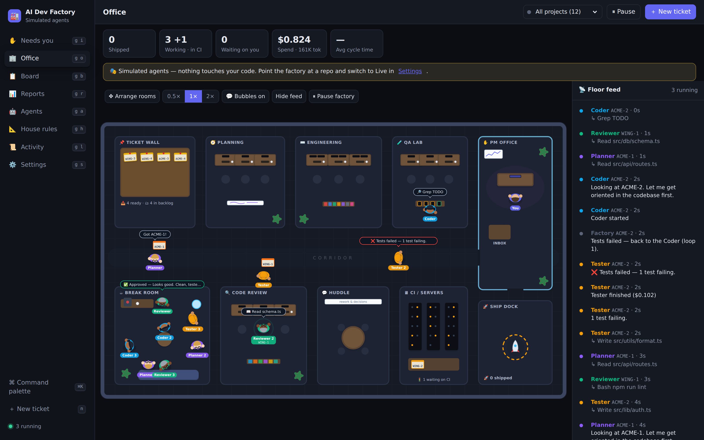
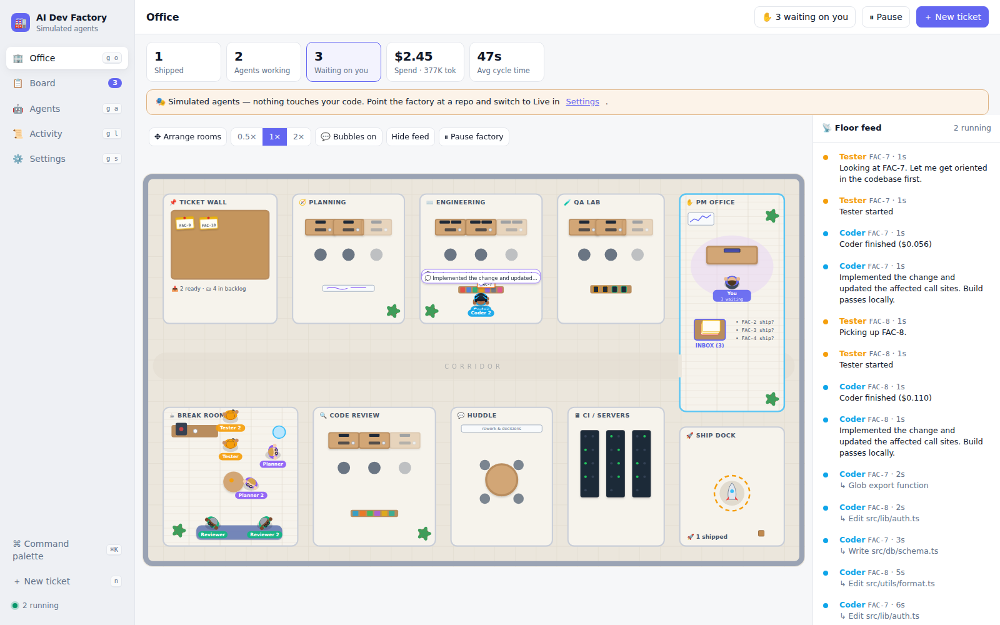
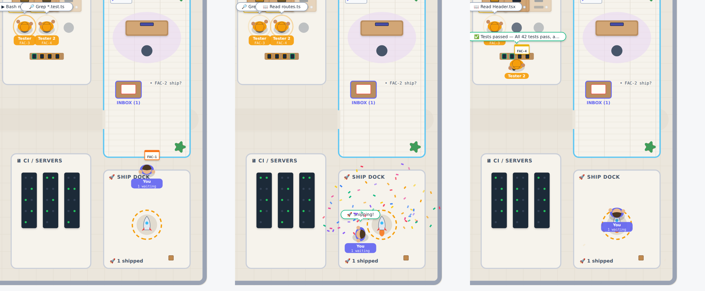
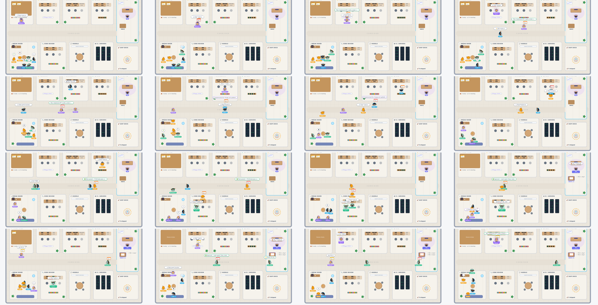

# 🏭 AI Dev Factory

A software factory where Claude agents work your tickets and you run the floor as the PM.



```
📥 Ready → 🧭 Planner → ⌨️ Coder → 🧪 Tester → 🔍 Reviewer → ✋ You → 🚀 Shipped
                           ↑__________ rework loop __________|
```

- **Agents**: Planner, Coder, Tester and Reviewer, each a Claude Agent SDK session running in the ticket's own **git worktree** (branch `factory/<key>-<slug>`). Every role can be turned on or off. You can edit each role's prompt, model, tools and turn limit in the UI.
- **You're the PM**: drag tickets from Backlog into Ready to hand them to the factory. You can approve plans (optional gate), sign off on the final diff, or send work back with feedback. You can also add notes that every agent treats as top priority, stop work in progress, and pause the whole factory.
- **Rework loop**: failed tests or requested review changes go back to the Coder automatically. When the rework limit is hit, the ticket comes to you.
- **Needs you inbox** ✋: everything the agents need from you is in one queue: sign-offs, plan approvals, escalations and errors. Each item comes with a brief: what we recommend, what settles it, why it's being asked now, and what happens if it waits. When a question is re-asked, the newer version replaces the old one, so you only ever see the latest.
- **Guided review walkthrough**: the Reviewer writes setup steps plus 2–6 test cases for each change. You go through them one screen at a time, each with a "You should see…" box, and approve it or leave feedback. When every case is approved, it ships. Any feedback goes back to the Coder as one consolidated message. Your progress is saved as you go.
- **CI-aware merge gate** 🚦: with pull requests, the factory opens the PR before your sign-off and holds the sign-off until the required checks are green. Red CI goes back to the Coder, not to you. When you approve, the PR is merged with squash, merge or rebase, whichever you pick.
- **Watchdog** ⏰: an agent that goes quiet (for example, a hung command or a wait that never ends) is restarted with a nudge. You only hear about it if nudging doesn't work. The board is also reconciled continuously, so a ticket's stage always matches what's actually happening.
- **Harvest time tracking** ⏱: tracks your PM time. When you open something that needs you, a timer starts on the ticket's Harvest project, and it stops when you decide. You can also log hours manually per ticket. Today's total and the running timer sit in the top bar.
- **Ticket sources**: a built-in board plus **GitHub Issues, Linear and Jira**. Tickets are imported into Backlog, and progress is sent back to the tracker as comments and status changes.
- **Shipping**: when you approve, the change is merged locally, pushed as a GitHub PR, or left on the branch. You choose which in Settings.
- **The Office** 🏢: a live, top-down animated office. Each agent is a character. They pull tickets off the Ticket Wall and carry them desk to desk on each handoff. When review or tests send work back, they meet at the Huddle table. Finished work goes to your PM inbox, and approved work launches from the Ship Dock. Speech bubbles show which tool each agent is running as it happens.
  - Drag characters around. Idle ones stay where you drop them.
  - Click a character to rename it or change its outfit, skin, hair and accessory.
  - Use **Arrange rooms** to drag whole rooms into your own layout.
- **Customizable UI**: theme, accent color, density, which board columns show, which fields cards show, header widgets, grouping, and the default view. Also includes a ⌘K command palette and keyboard shortcuts (`n` new ticket, `g i/o/b/a/l/s` to navigate, `/` to filter).

## Quick start

Requires Node 20+ and git.

```bash
git clone https://github.com/KrisCagle/ai-dev-factory.git
cd ai-dev-factory
npm install
npm run build
npm start                 # → http://localhost:4317
```

The factory starts with **simulated agents**, so you can try the whole flow without an API key or touching any code. Click **Load demo tickets** in the Office and watch the team work.

For development with hot reload: `npm run dev`, then open http://localhost:5173.

**Troubleshooting**

- `EALLOWSCRIPTS` during install: your user `.npmrc` sets `allow-scripts`, which npm rejects for project installs. On macOS/Linux, run `npm run setup` instead: it clears that setting for the install, then builds and starts the app.
- `npm install` fails with 401/E404: your npm may point at a private registry. Run `npm install --registry=https://registry.npmjs.org/`.

## Screenshots

| Board | Hand-off to the ship dock |
| --- | --- |
|  |  |



## Going live

1. Authenticate the Claude Agent SDK by setting `ANTHROPIC_API_KEY` in the server's environment (for example `export ANTHROPIC_API_KEY=sk-ant-…` before `npm start`).
2. Open **Settings** and set the **Repository path** (a local git repo) and the **Base branch**, then switch the factory mode to **Live**.
3. Choose what **Approve** does: merge locally, open a PR (needs the GitHub connector), or leave the branch.
4. Set a **Budget per ticket**. Agents stop and escalate to you when they reach it.

Agents load your repo's `CLAUDE.md`, so put team conventions there.

Environment variables (all optional): `PORT`, `FACTORY_MODE=live|mock`, `FACTORY_REPO=/path/to/repo`, `FACTORY_DATA=/path/db.json`, `GITHUB_TOKEN`, `LINEAR_API_KEY`, `JIRA_TOKEN`, `HARVEST_TOKEN`, `HARVEST_ACCOUNT_ID`.

**Harvest:** create a personal access token at Harvest ID → Developers. In Settings → Harvest, paste the token and your account ID, click **Test & load projects**, and pick a default project and task. Individual tickets can bill to a different project from the ticket drawer.

**CI gate in live mode:** set "When you approve" to *Push branch & open a GitHub PR* and connect GitHub, with a token that has `repo` scope so the factory can read checks and merge.

## Safety notes

- Agents run with `acceptEdits` permission mode. They are limited to the tools you allow for each role, and they work inside a separate worktree, never in your checkout.
- The Coder and Tester can run `Bash` by default. Remove it on the Agents page if you'd rather they didn't.
- State, including connector tokens, is stored in plain JSON at `.factory/db.json`. Keep that file out of version control (it is already in `.gitignore`). Tokens are masked before they reach the browser.
- Local merge runs `git merge --no-ff` in your repo, so keep the base branch checked out and clean. If the merge fails, the ticket moves to Failed and nothing is forced.

## Layout

```
server/src
  index.ts            REST + WebSocket API, serves the built UI
  orchestrator.ts     scheduler + pipeline (plan → code → test → review → CI → gates → ship), watchdog, reconcile
  attention.ts        the PM inbox: decision briefs, sign-off walkthroughs, escalations
  harvest-service.ts  PM time tracking (timers + manual entries)
  agents/runner.ts    Claude Agent SDK runner (structured JSON output for plan/test/review)
  agents/mock.ts      simulated agents for demo mode
  agents/defaults.ts  default role prompts, models, tools
  connectors/         github.ts (issues, PRs, checks) · linear.ts · jira.ts · harvest.ts
  git.ts              worktrees, commits, diff, merge, push
  store.ts            JSON-file store
web/src
  views/office/       animated office (layout, simulation, sprites)
  views/              Board, Agents, Activity, Settings
  components/         ticket drawer, diff viewer, command palette
```

## Roadmap

Already shipped: agent pipeline, animated office, Needs you inbox with decision briefs, guided review walkthrough, CI-aware merge gate, watchdog, and Harvest time tracking.

**Next up** ⭐

- **Multiple repos and projects**: a board, settings, Harvest project and office floor for each repo or client, with a switcher at the top.
- **Live preview per ticket**: run the app from the ticket's branch copy on its own port, so the walkthrough's links open the running change.
- **Ticket writer**: a Scoper agent that turns a rough idea, bug report or Slack thread into a ticket with acceptance criteria, and asks you only what's unclear.
- **Notifications**: desktop and Slack pings when something needs you, CI keeps failing, or a ticket ships.

**Later**

- **Open in VS Code**: open the ticket's branch copy in VS Code to take over by hand, then hand it back to the agents.
- **Screenshots and recordings in reviews**: the Tester attaches Playwright before/after captures to walkthrough cases.
- **Repo house rules**: edit the repo's `CLAUDE.md` in the UI, and let review feedback suggest new rules.
- **Daily standup and weekly report**: shipped, waiting on you, blocked, spend and Harvest hours, ready to share.
- **Spend dashboard**: cost per ticket, agent and project over time, with a daily cap that pauses the factory.
- **Dependencies and parallel planning**: "B waits on A", and never running two tickets that touch the same files at once.
- **Office replay**: scrub back through a ticket's day in the office view.

**Platform**

- Swap the JSON store for SQLite/Postgres and add multi-user auth
- Webhooks from GitHub/Linear/Jira instead of manual import
- More roles (Security reviewer, Docs writer) using the same `AgentConfig` shape
- Run agents in containers for stronger isolation

## License

[MIT](LICENSE) © Kris Cagle
