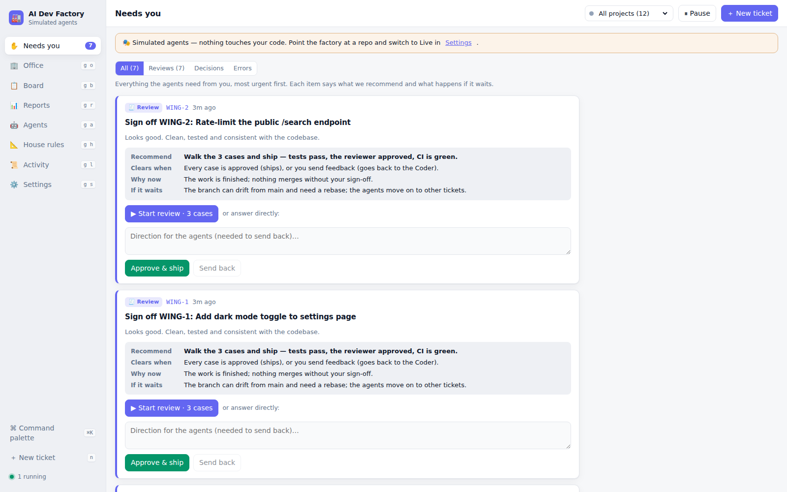
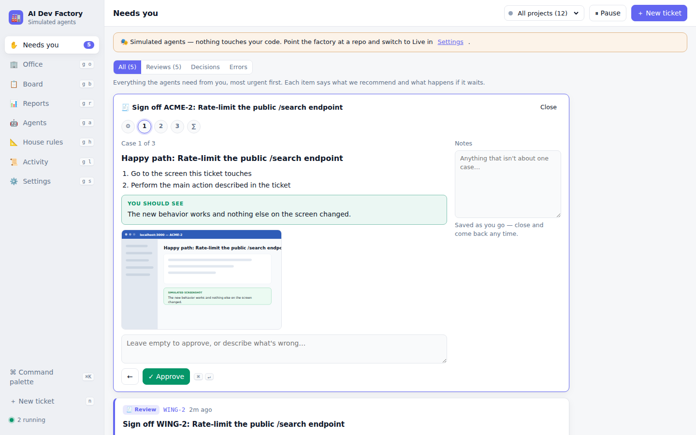
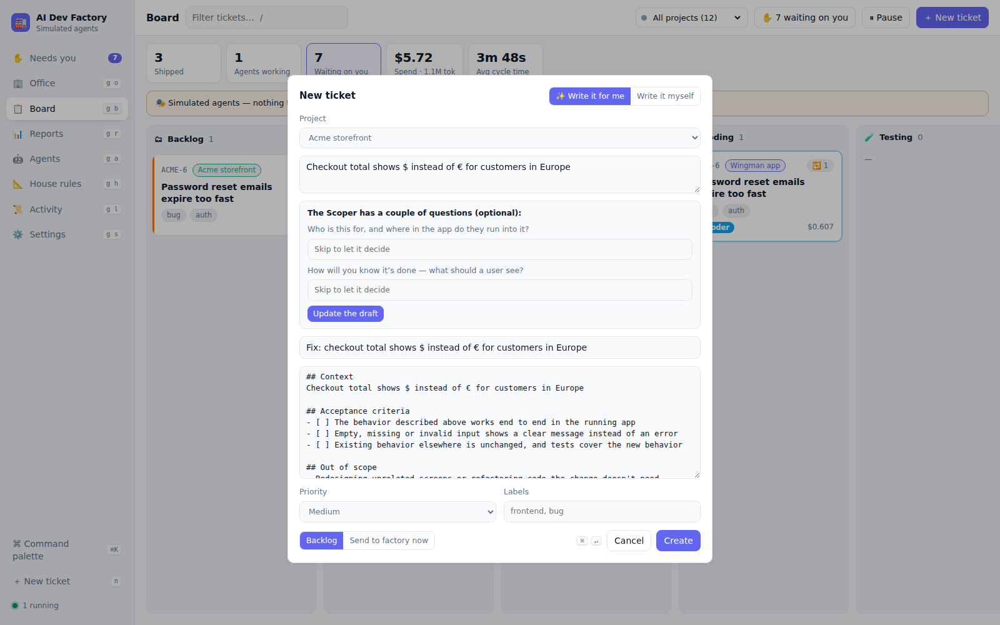
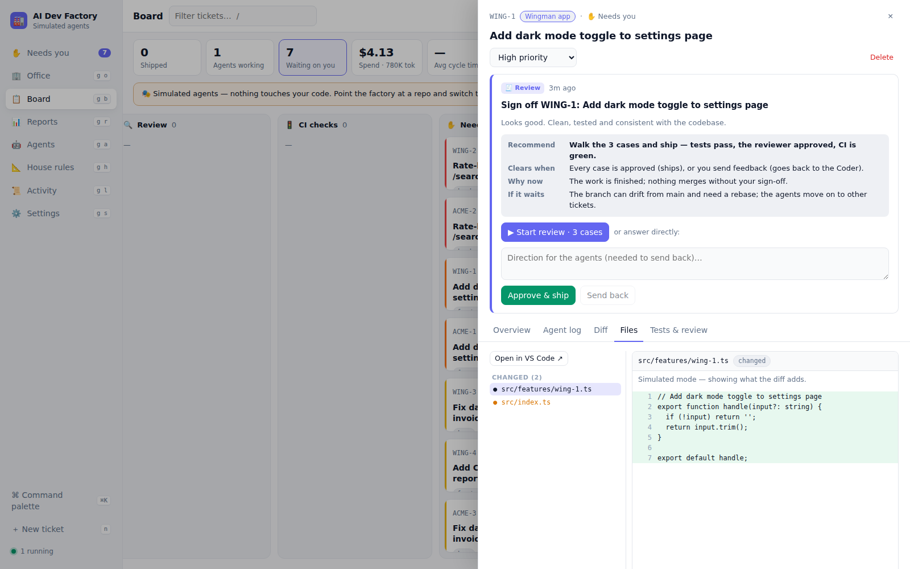
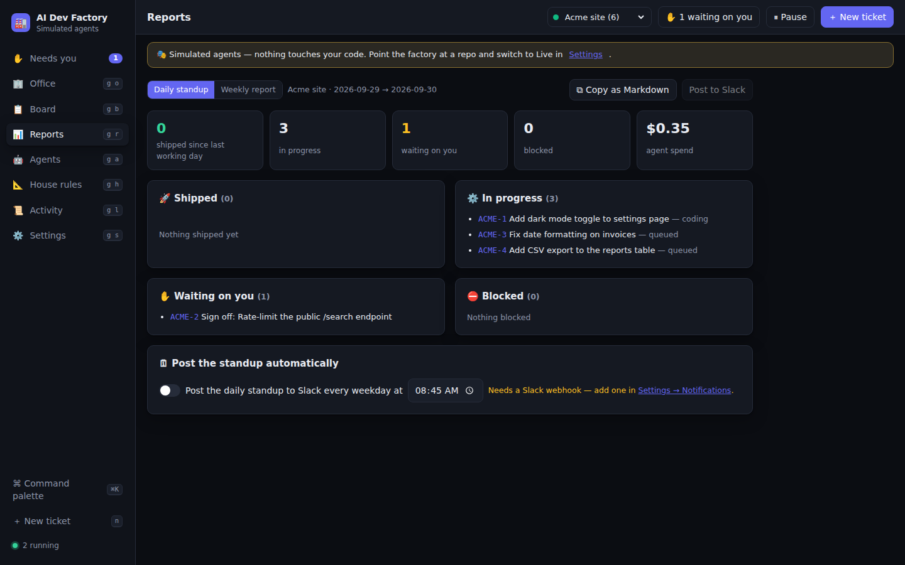
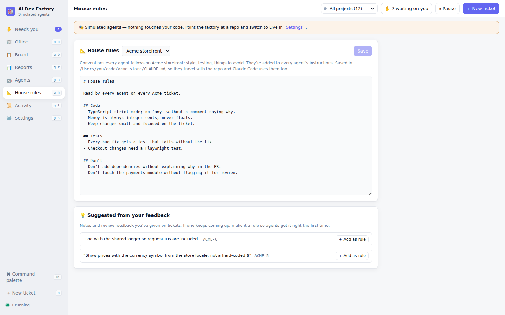
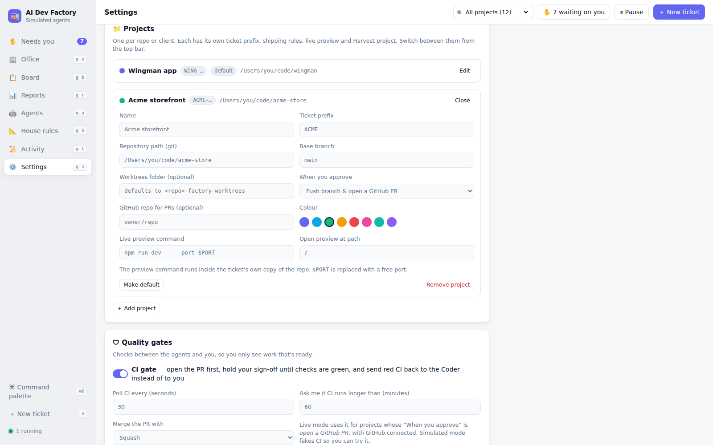
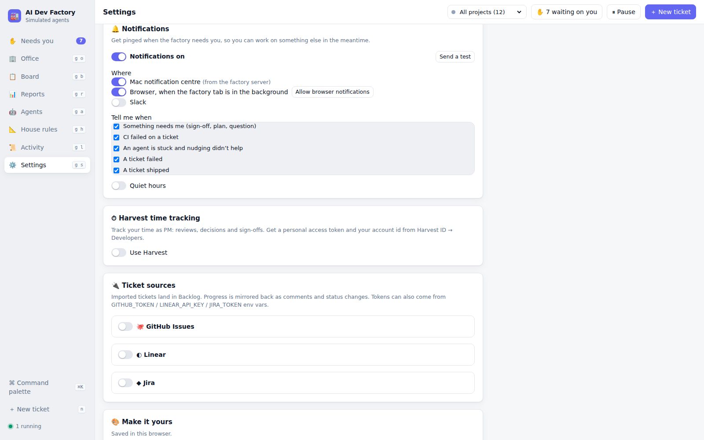

# 🏭 AI Dev Factory

A software factory where Claude agents work your tickets and you run the floor as the PM.

You write or import tickets. A team of four agents (Planner, Coder, Tester, Reviewer) plans, builds, tests and reviews each one in its own branch. You only step in when they need a decision or your sign-off, and you watch it all happen in an animated office.


```
📥 Ready → 🧭 Planner → ⌨️ Coder → 🧪 Tester → 🔍 Reviewer → 🚦 CI → ✋ You → 🚀 Shipped
                           ↑______________ rework loop ______________|
```

## What's inside

### The agent team

- **Four agents**: Planner, Coder, Tester and Reviewer. Each is a Claude Agent SDK session running in the ticket's own **git worktree** (branch `factory/<key>-<slug>`), never in your checkout. Every role can be turned on or off, and you can edit its prompt, model, tools and turn limit.
- **Rework loop**: failed tests or requested review changes go back to the Coder automatically. When the rework limit is hit, the ticket comes to you.
- **Watchdog** ⏰: an agent that goes quiet (a hung command, a wait that never ends) is restarted with a nudge. You only hear about it if nudging doesn't work.
- **CI-aware merge gate** 🚦: with pull requests, the factory opens the PR first and holds your sign-off until checks are green. Red CI goes back to the Coder, not to you. On approval the PR is merged with squash, merge or rebase.
- **House rules** 📐: edit the conventions every agent follows. They're saved in the repo's `CLAUDE.md`, and feedback you keep giving on tickets is suggested as new rules.

### Your job as PM

- **Needs you inbox** ✋: every sign-off, plan approval, escalation and error in one queue. Each item says what we recommend, what settles it, why it's being asked now, and what happens if it waits.
- **Guided review walkthrough**: the Reviewer writes setup steps and 2–6 test cases for each change. You step through them one at a time, with a "You should see…" box and the **Tester's screenshot** for each case, then approve or leave feedback. Your progress is saved as you go.
- **Live preview** ▶: run your app from a ticket's branch copy on its own port and click through the change before you sign off.
- **Code viewer**: a Files tab on every ticket shows the changed files first with added lines highlighted, and has **Open in VS Code** to take over by hand.
- **Ticket writer** ✨: type a rough idea, bug report or Slack thread and the Scoper turns it into a ticket with a clear title, context and acceptance criteria. It asks at most two questions, and you can skip them.
- **Notes and control**: add notes every agent treats as top priority, approve plans before coding (optional), stop a ticket, or pause the whole factory.

### Running more than one thing

- **Projects** 📁: several repos or clients in one factory. Each has its own ticket prefix (`WING-12`), repo, base branch, shipping rule, preview command and Harvest project. Switch from the top bar, or see them all together.
- **Ticket sources**: a built-in board plus **GitHub Issues, Linear and Jira**. Imported tickets land in Backlog, and progress is sent back as comments and status changes.
- **Shipping**: on approval, merge locally, open a GitHub PR, or leave the branch. Set per project.

### Finding the work 🎯

- **Lead scouts**: scouts read public posts on Hacker News and Reddit for companies that might pay you to build, rescue or maintain their software. A keyword pass keeps the cost down, then Claude decides whether each post is a real buying signal, which of your service lines it fits, and a one-line opening for outreach.
- **Leads view**: a ranked list with the post, what they need, the score, and your notes. Move leads through New → Reviewing → Contacted, or pass. **Won** creates a kickoff ticket in the Backlog.
- **Hot leads come to you**: anything scoring above your threshold lands in Needs you with Pursue/Pass.
- **Your profile stays local**: your agency, service lines, phrases, weights and every lead are saved in the data folder (`.factory/lead-profile.json`, `.factory/leads.json`), never in the repo. Run on demand or on a schedule.

### Staying in the loop

- **Notifications** 🔔: Mac, browser and Slack pings when something needs you, CI fails, an agent is stuck, or a ticket ships or fails. Every channel and event can be switched off, with quiet hours.
- **Standup and weekly report** 📊: shipped, in progress, waiting on you, blocked, agent spend and Harvest hours. Copy as Markdown, post to Slack, or have the standup posted every weekday.
- **Harvest time tracking** ⏱: a timer starts on the ticket's Harvest project when you open something that needs you and stops when you decide. You can also log hours by hand. Today's total sits in the top bar.

### The Office 🏢

A live, top-down animated office. Each agent is a character that pulls tickets off the Ticket Wall and carries them desk to desk. When review or tests send work back, they meet at the Huddle table. Builds wait in the CI server room, finished work goes to your PM office, and approved work launches from the Ship Dock. Speech bubbles show which tool each agent is running.

- Drag characters around; idle ones stay where you drop them.
- Click a character to rename it or change its outfit, skin, hair and accessory.
- Use **Arrange rooms** to drag whole rooms into your own layout.

### Make it yours

Theme, accent color, density, board columns, card fields, header widgets, grouping and default view. There's a ⌘K command palette and keyboard shortcuts: `n` new ticket, `g` then `i/o/b/r/a/h/l/s` to navigate, `/` to filter.

## Screenshots

| Needs you inbox | Review walkthrough with screenshots |
| --- | --- |
|  |  |
| **Board across two projects** | **Ticket writer** |
|  |  |
| **Code viewer** | **Daily standup** |
|  |  |
| **House rules** | **Projects** |
|  |  |

| Notifications | Hand-off to the ship dock |
| --- | --- |
|  |  |


## Quick start

Requires Node 20+ and git.

```bash
git clone https://github.com/KrisCagle/ai-dev-factory.git
cd ai-dev-factory
npm install
npm run build
npm start                 # → http://localhost:4317
```

The factory starts with **simulated agents**, so you can try the whole flow without an API key or touching any code. Click **Load demo tickets** in the Office and watch the team work.

For development with hot reload: `npm run dev`, then open http://localhost:5173.

**Troubleshooting**

- `EALLOWSCRIPTS` during install: your user `.npmrc` sets `allow-scripts`, which npm rejects for project installs. On macOS/Linux, run `npm run setup` instead: it clears that setting for the install, then builds and starts the app.
- `npm install` fails with 401/E404: your npm may point at a private registry. Run `npm install --registry=https://registry.npmjs.org/`.

## Tests

Everything runs against the simulated agents, so tests are free, fast and don't need an API key.

```bash
npm test              # unit + API tests (~60 tests, a few seconds)
npm run test:e2e      # browser tests with Playwright: walkthrough, ship, projects, ticket writer…
npm run test:all      # typecheck + both of the above
```

- **Unit and API tests** (`server/test`) cover the whole pipeline: rework loops, the CI gate, the watchdog, plan approval, escalation, budgets, restarts, inbox briefs, notifications, the ticket writer, settings upgrades, and secrets staying out of every response. The simulated agents run about 100× faster with seeded randomness, and each test can force an outcome (tests fail, reviewer pushes back, an agent hangs, CI goes red).
- **End-to-end tests** (`e2e/`) drive the real UI in Chromium against a throwaway database and fail on any browser console error.
- **GitHub Actions** runs typecheck, unit tests (Node 20 and 22) and the browser tests on every pull request.

To watch a faster demo yourself: `FACTORY_MOCK_SPEED=0.2 npm start` runs the simulated agents 5× faster.

## Going live

1. Authenticate the Claude Agent SDK by setting `ANTHROPIC_API_KEY` in the server's environment (for example `export ANTHROPIC_API_KEY=sk-ant-…` before `npm start`).
2. Open **Settings → Projects** and set the project's **Repository path** (a local git repo) and **Base branch**, then switch the factory mode to **Live**. Add a project for each repo you want the factory to work on.
3. Choose what **Approve** does for each project: merge locally, open a PR (needs the GitHub connector), or leave the branch.
4. Set a **Budget per ticket**. Agents stop and escalate to you when they reach it.

Agents load your repo's `CLAUDE.md`, so put team conventions there. You can edit it from **House rules**.

**Live preview:** set a preview command per project in Settings → Projects. `$PORT` is replaced with a free port (from 5300 up), and the command runs inside the ticket's branch copy, so install dependencies there the way your project needs.

**Notifications:** Mac notifications come from the factory server via `osascript`. For Slack, create an incoming webhook and paste it in Settings → Notifications; the same webhook is used for the daily standup.

Environment variables (all optional): `PORT`, `FACTORY_MODE=live|mock`, `FACTORY_REPO=/path/to/repo`, `FACTORY_DATA=/path/db.json`, `GITHUB_TOKEN`, `LINEAR_API_KEY`, `JIRA_TOKEN`, `HARVEST_TOKEN`, `HARVEST_ACCOUNT_ID`, `FACTORY_MOCK_SPEED` (simulated agents only; 0.1 = 10× faster).

**Harvest:** create a personal access token at Harvest ID → Developers. In Settings → Harvest, paste the token and your account ID, click **Test & load projects**, and pick a default project and task. Individual tickets can bill to a different project from the ticket drawer.

**CI gate in live mode:** set "When you approve" to *Push branch & open a GitHub PR* and connect GitHub, with a token that has `repo` scope so the factory can read checks and merge.

## Safety notes

- Agents run with `acceptEdits` permission mode. They are limited to the tools you allow for each role, and they work inside a separate worktree, never in your checkout.
- The Coder and Tester can run `Bash` by default. Remove it on the Agents page if you'd rather they didn't.
- State, including connector tokens, is stored in plain JSON at `.factory/db.json`. Keep that file out of version control (it is already in `.gitignore`). Tokens are masked before they reach the browser.
- Local merge runs `git merge --no-ff` in your repo, so keep the base branch checked out and clean. If the merge fails, the ticket moves to Failed and nothing is forced.

## Layout

```
server/src
  index.ts            starts the server (reads env vars)
  app.ts              createFactory(): REST + WebSocket API, serves the built UI
  orchestrator.ts     scheduler + pipeline (plan → code → test → review → CI → gates → ship), watchdog, reconcile
  attention.ts        the PM inbox: decision briefs, sign-off walkthroughs, escalations
  harvest-service.ts  PM time tracking (timers + manual entries)
  scoper.ts           ticket writer (rough idea → ticket with acceptance criteria)
  previews.ts         live preview per ticket
  files.ts            code viewer + open in VS Code
  artifacts.ts        screenshots attached to reviews
  rules.ts            house rules (CLAUDE.md)
  notifier.ts         Mac / browser / Slack notifications
  reports.ts          standup and weekly report
  agents/runner.ts    Claude Agent SDK runner (structured JSON output for plan/test/review)
  agents/mock.ts      simulated agents for demo mode
  agents/defaults.ts  default role prompts, models, tools
  connectors/         github.ts (issues, PRs, checks) · linear.ts · jira.ts · harvest.ts
  git.ts              worktrees, commits, diff, merge, push
  store.ts            JSON-file store
server/test           unit + API tests (vitest)
e2e/                  browser tests (Playwright)
web/src
  views/office/       animated office (layout, simulation, sprites)
  views/              Inbox, Board, Reports, House rules, Agents, Activity, Settings
  components/         ticket drawer, diff viewer, command palette
```

## Roadmap

Already shipped: agent pipeline, animated office, Needs you inbox with decision briefs, guided review walkthrough, CI-aware merge gate, watchdog, Harvest time tracking, projects, ticket writer, live preview, code viewer, screenshots in reviews, house rules, notifications, and standup/weekly reports.

**Next up** ⭐

- **Spend dashboard**: cost per ticket, agent and project over time, with a daily cap that pauses the factory.
- **Dependencies and parallel planning**: "B waits on A", and never running two tickets that touch the same files at once.
- **Office replay**: scrub back through a ticket's day in the office view.
- **Recordings in reviews**: short Playwright videos next to the screenshots.
- **Hand back from VS Code**: after editing a ticket's branch by hand, send it back to the Tester and Reviewer.

**Platform**

- Swap the JSON store for SQLite/Postgres and add multi-user auth
- Webhooks from GitHub/Linear/Jira instead of manual import
- More roles (Security reviewer, Docs writer) using the same `AgentConfig` shape
- Run agents in containers for stronger isolation

## License

[MIT](LICENSE) © Kris Cagle
